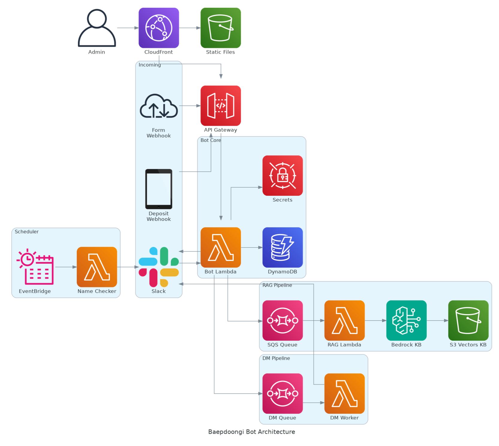

# 뱁둥이 봇 (Baepdoongi Bot)

IGRUS 동아리 운영 자동화를 위한 Slack 봇 및 관리자 대시보드

## 아키텍처



## 기술 스택

- **백엔드**: Node.js 22+, TypeScript, Slack Bolt, AWS Lambda
- **프론트엔드**: Next.js 15 (Static Export), React 19, TailwindCSS
- **인프라**: AWS CDK, API Gateway, DynamoDB, S3, CloudFront, SQS, Secrets Manager, SES
- **AI**: Amazon Bedrock (Knowledge Base, Claude Haiku 4.5, Titan Embeddings)

## 주요 기능

### Slack Bot

- 신규 회원 온보딩 DM 발송
- 이름 형식 검사 및 경고 (`이름/학과/학번`)
- 정기 이름 체크 스케줄러 (매일 오전 9시)
- RAG 기반 Q&A (@뱁둥이 멘션)
- `/가이드`, `/익명건의` 슬래시 커맨드

### 관리자 대시보드

- 회원 관리: 목록 조회, 동기화, 이름 경고 DM 발송
- 이벤트 관리: 생성/수정/삭제, Slack 채널 공지, 참석 응답 집계
- 건의사항: 익명 건의 조회, 답장 발송
- 활동 로그: 모든 작업 내역 기록 및 조회

### 회비 관리

- 지원서 관리: Google Forms 연동, 지원서 목록 조회
- 입금 매칭: 토스뱅크 입금 알림 웹훅, 자동/수동 매칭
- 초대 발송: SES를 통한 Slack 초대 이메일 발송

## 프로젝트 구조

```
packages/
  bot/        # Slack Bot + Dashboard API (Lambda)
  dashboard/  # 관리자 대시보드 (Static SPA)
  shared/     # 공유 TypeScript 타입
infra/        # AWS CDK 인프라
```

## 개발 환경

```bash
# 의존성 설치
pnpm install

# 개발 서버
pnpm dev:bot         # Bot (Socket Mode)
pnpm dev:dashboard   # Dashboard (localhost:3001)

# 빌드 및 배포
pnpm build
pnpm cdk:deploy
```

## 환경 변수

Secrets Manager에서 관리:
- `SLACK_BOT_TOKEN`, `SLACK_SIGNING_SECRET`, `SLACK_APP_TOKEN`
- `DASHBOARD_PASSWORD`
- `GOOGLE_SHEETS_CREDENTIALS`, `GOOGLE_SHEETS_ID`
- `TOSS_WEBHOOK_SECRET`
